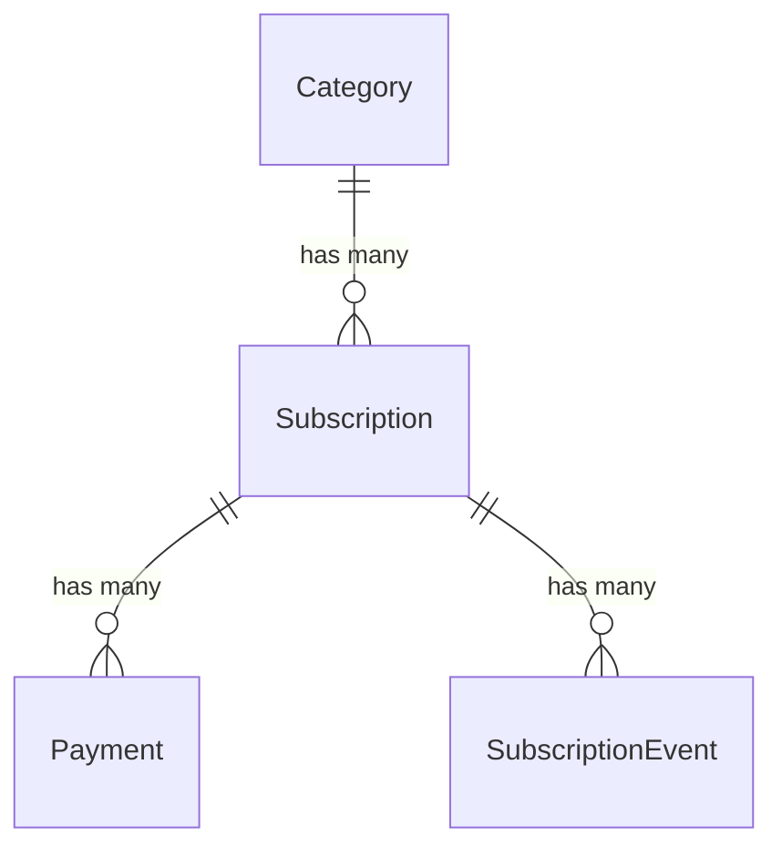

# Domain Model

All entities live in `src/Entity/` and share these design patterns:

- **ULID primary keys** via `symfony/uid`, generated in the constructor
- **`public private(set)` properties** (PHP 8.4+) for external readability without external mutation
- **`beberlei/assert`** for constructor invariant validation
- **No setters** — state changes go through named domain methods

## Subscription

The core entity. Tracks a recurring payment with its cost, billing period, and metadata.

**Properties:**

| Property | Type | Notes |
|----------|------|-------|
| `id` | `Ulid` | Generated in constructor |
| `archived` | `bool` | Default `false` |
| `createdAt` | `DateTimeImmutable` | Set in constructor |
| `category` | `Category` | Required, ManyToOne |
| `name` | `string` | Non-empty (validated) |
| `lastPaidDate` | `DateTimeImmutable` | When last payment occurred |
| `paymentPeriod` | `PaymentPeriod` | Year, Month, or Week |
| `paymentPeriodCount` | `int` | Must be > 0 |
| `cost` | `int` | In cents, must be > 0 |
| `description` | `string` | Optional |
| `link` | `string` | Optional |
| `logo` | `string` | File path, optional |

**Collections:**

- `payments` — `OneToMany` to `Payment`, cascade persist+remove, orphanRemoval
- `subscriptionEvents` — `OneToMany` to `SubscriptionEvent`, cascade persist+remove, orphanRemoval

**Domain Methods:**

### `update(...)`

Accepts all mutable fields. Uses two `ChangeContextGenerator` instances to diff:

1. **General fields** (category, name, lastPaidDate, description, link, logo) — emits a `SubscriptionEventType::Update` event if any changed
2. **Cost fields** (paymentPeriod, paymentPeriodCount, cost) — emits a `SubscriptionEventType::CostChange` event if any changed

Events are only created when values actually differ from the current state.

### `archive()` / `unarchive()`

Toggle the `archived` flag and emit an `Archive` or `Unarchive` event with empty context.

### `recordPayment(...)`

Creates a new `Payment` child entity and updates `lastPaidDate`. Accepts an optional `amount` parameter; defaults to the subscription's `cost` if not provided.

## Payment

Records a single payment transaction linked to a subscription.

| Property | Type | Notes |
|----------|------|-------|
| `id` | `Ulid` | Generated in constructor |
| `subscription` | `Subscription` | Required, ManyToOne |
| `type` | `PaymentType` | `Verified` or `Generated` |
| `amount` | `int` | In cents, must be > 0 |
| `createdAt` | `DateTimeImmutable` | When the payment occurred |

`Verified` payments are entered manually by the user. `Generated` payments are created automatically by the scheduler when a payment is due.

## Category

Groups subscriptions. Simple entity with a name and a collection of subscriptions.

| Property | Type | Notes |
|----------|------|-------|
| `id` | `Ulid` | Generated in constructor |
| `name` | `string` | Non-empty (validated) |
| `subscriptions` | `Collection<Subscription>` | OneToMany, read-only |

The only mutation method is `setName()`. Categories cannot be deleted if they have subscriptions (`CategoryHasSubscriptionsException`).

## SubscriptionEvent

Audit log entry for subscription state changes.

| Property | Type | Notes |
|----------|------|-------|
| `id` | `Ulid` | Generated in constructor |
| `subscription` | `Subscription` | Required, ManyToOne |
| `type` | `SubscriptionEventType` | The kind of change |
| `context` | `array` | JSON — field diffs for Update/CostChange, empty for Archive/Unarchive |
| `createdAt` | `DateTimeImmutable` | When the event occurred |

**Validation rules in the constructor:**

- `Archive` and `Unarchive` events **must** have empty context
- `Update` and `CostChange` events **must** have non-empty context

**Context format** (for Update and CostChange events):

```json
{
  "fieldName": {
    "old": "previous value",
    "new": "current value"
  }
}
```

## Enums

Three backed string enums in `src/Enum/`:

**`PaymentPeriod`** — `year`, `month`, `week`

**`PaymentType`** — `verified` (manual), `generated` (scheduler)

**`SubscriptionEventType`** — `costChange`, `update`, `archive`, `unarchive`

## ChangeContextGenerator

A utility in `src/Lib/ChangeContextGenerator/` that compares old and new values to produce diff arrays.

- `Change` — value object with `field`, `current`, and `new` properties
- `ChangeContextGenerator` — accepts an array of `Change` objects, returns only the fields where values differ

Used by `Subscription::update()` to build event context without manual comparison logic.

## Entity Relationships


