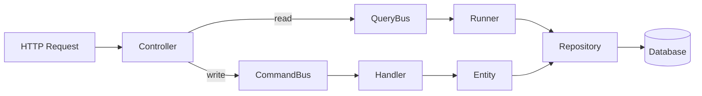

# Architecture Overview

Obol is a Symfony application that manages recurring subscriptions with payment tracking and full audit history. This section documents the core architectural patterns and how the pieces fit together.

## Request Flow



Controllers are invokable single-action classes that dispatch messages through the appropriate bus. Commands mutate state through handlers; queries read state through runners. Entities contain domain logic and enforce invariants.

## Domain Entities

Four entities form the domain model. All use ULID primary keys and PHP 8.4's `public private(set)` property syntax.

| Entity | Purpose | Key Relationships |
|--------|---------|-------------------|
| [Subscription](domain-model.md#subscription) | Core entity tracking a recurring payment | Has many Payments, SubscriptionEvents; belongs to Category |
| [Payment](domain-model.md#payment) | Records an individual payment transaction | Belongs to Subscription |
| [Category](domain-model.md#category) | Groups subscriptions | Has many Subscriptions |
| [SubscriptionEvent](domain-model.md#subscriptionevent) | Audit trail for subscription changes | Belongs to Subscription |

## Key Architectural Decisions

**ULID Primary Keys** — All entities use Symfony ULIDs instead of auto-incrementing integers. ULIDs are sortable by creation time, have no sequence contention, and are URL-safe.

**CQRS via Symfony Messenger** — Three separate message buses ([command, query, event](cqrs.md)) enforce a strict separation between reads and writes. Each bus has its own middleware stack.

**Event Sourcing for Audit** — State changes on `Subscription` emit `SubscriptionEvent` records. The `update()` method uses `ChangeContextGenerator` to diff old and new values, creating events only when fields actually change.

**Immutable Properties** — Entities use `public private(set)` (PHP 8.4+) to allow external reads but prevent external mutation. All state changes go through dedicated domain methods.

**Invariant Enforcement** — Entity constructors use `beberlei/assert` to validate inputs (non-empty names, positive costs, etc.). Invalid state is rejected at construction time.

## Directory Map

```
src/
├── Controller/       # Invokable single-action controllers
├── DataFixtures/     # Development seed data
├── Dto/              # Form input DTOs with validator constraints
├── Entity/           # Doctrine entities with domain logic
├── Enum/             # PHP 8.1 backed enums
├── Exception/        # Domain exceptions
├── Factory/          # Foundry factories (tests + fixtures)
├── Form/             # Symfony Form types
├── Lib/              # Framework-agnostic utilities
│   ├── Bus/          # CommandBus, QueryBus, EventBus wrappers
│   └── ChangeContextGenerator/
├── Message/          # CQRS messages
│   ├── Command/      # Commands + Handlers
│   ├── Query/        # Queries + Runners
│   └── Scheduler/    # Scheduled tasks
├── Repository/       # Doctrine repositories
├── Schedule.php      # Symfony Scheduler provider
└── Service/          # Application services
```
