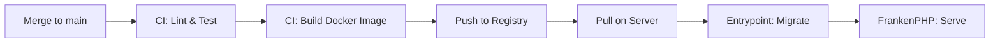

# Deploying Updates

This page covers how to deploy new versions of Obol and handle database migrations.

## Deployment Flow



1. Merge a PR to `main`
2. CI runs the full lint and test suite
3. CI builds a Docker image and pushes it to `code.dev88.work/dev88/obol` with `:latest` and `:{sha}` tags
4. On the server, pull the new image and restart

## Updating the Server

```bash
docker compose pull
docker compose up -d
```

The entrypoint script runs `doctrine:migrations:migrate --no-interaction --allow-no-migration` before starting FrankenPHP. Migrations are applied automatically on every container start.

## Writing Migrations

Generate a new migration:

```bash
php bin/console doctrine:migrations:generate
```

Or let Doctrine diff your entities against the current schema:

```bash
php bin/console doctrine:migrations:diff
```

Edit the generated file in `migrations/` to adjust the SQL if needed. Migrations should be idempotent where possible.

## Checking Migration Status

```bash
php bin/console doctrine:migrations:status
```

This shows which migrations have been applied and which are pending.

## Rolling Back

To revert the last migration:

```bash
php bin/console doctrine:migrations:migrate prev
```

!!! warning
    Rollback requires `down()` methods in the migration. Not all migrations are reversible — check before relying on this.

## Rollback Strategy for Bad Deployments

Docker images are tagged with the short commit SHA. To roll back to a previous version:

```bash
# Find the previous image tag
docker image ls code.dev88.work/dev88/obol

# Update compose to use a specific tag, or pull directly
docker compose pull
docker compose up -d
```

Alternatively, pin the image tag in `compose.yaml` to a known good SHA.

## Fixtures

Fixtures (`php bin/console doctrine:fixtures:load`) are for development only. Never load fixtures in production — they truncate tables before inserting sample data.
