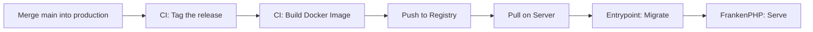

This page covers how to deploy new versions of Obol and handle database migrations.

## Deployment Flow



1. Merge a `main` -> `production` PR (the PR itself ran the full lint and test suite)
2. CI derives the next CalVer version and pushes the git tag
3. CI builds a Docker image and pushes it to `code.dev88.work/dev88/obol` under the version, the
   short SHA, and `:latest`
4. On the server, point `OBOL_IMAGE` at the new version, pull, and recreate

See [Releases and Versioning](releases.md) for the version scheme and the full release procedure.

## Updating the Server

```bash
bin/dc-prod pull
bin/dc-prod up -d
```

:::caution
Use the wrapper, not a bare `docker compose`. `bin/dc-prod` pins the whole file chain
(`compose.yaml:compose.prod.yaml:compose.prod.tunnel.yaml`) and the deploy env file. Without that
pinning, Compose renders the base `compose.yaml` alone and redeploys something that is not the
production stack, and reads the checkout's own `.env`, whose committed defaults quietly satisfy the
guards meant to catch a missing secret. See
[Running in Production](../deployment.md#running-in-production).
:::

`pull` then `up -d`, never `down` then `up`: recreating only the containers whose image or definition
changed leaves the database running, where a teardown stops it too.

The entrypoint script runs `doctrine:migrations:migrate --no-interaction --all-or-nothing` before
starting FrankenPHP, so migrations are applied on every container start and always finish before the
server accepts a request. Only the `php` container runs them, and every container independently
refuses to start against a schema older than its code; see [Entrypoint](../deployment.md#entrypoint).

:::caution[A failed migration stops the container rather than starting it]
The deploy fails visibly - `php` restart-loops instead of coming up - which is the intended outcome: a
container serving against a half-migrated schema throws on every request that touches a session. Read
`bin/dc-prod logs php` for the Doctrine error and fix the migration.
:::

### What a recreate discards, and what survives

Recreating the application container throws away everything in `var/` - the compiled cache, the built
CSS. That is deliberate, and it is what makes a pull-and-recreate reliable: the image
carries its own compiled cache and built CSS, so the release you pulled is the one that serves.

What survives does so because it is in PostgreSQL, not because a volume held it: domain data,
signed-in sessions, the scheduler's missed-run state, and the magic-link replay guard. A deploy
therefore leaves users signed in and leaves redeemed magic links redeemed. See
[State and storage](../deployment.md#state-and-storage).

Logs survive too, by a different route: production writes none to `var/`, streaming them to the
container's output and on to the host's systemd journal instead. A recreate does not reach them. See
[Container logs](../deployment.md#container-logs).

## Writing Migrations

Generate a new migration:

```bash
php bin/console doctrine:migrations:generate
```

Or let Doctrine diff your entities against the current schema:

```bash
php bin/console doctrine:migrations:diff
```

Edit the generated file in `migrations/` to adjust the SQL if needed. Migrations should be idempotent where possible.

### The founder ownership migration

One migration is a deploy gate. When per-row ownership landed (ADR-0015), a migration adds the `owner` columns to `subscription` and `payment`, *seeds the founder account* (a `User` plus a primary verified `UserEmail`), backfills every existing row to the founder, then flips the columns to `NOT NULL`. It is irreversible — `down()` throws.

Because the founder logs in by magic link, the prod mailer must be live and `app:mailer:smoke` must pass *before* this migration runs. If it runs first, the founder's first login has no working mailbox to reach and locks them out.

## Checking Migration Status

```bash
php bin/console doctrine:migrations:status
```

This shows which migrations have been applied and which are pending.

## Rolling Back

To revert the last migration:

```bash
php bin/console doctrine:migrations:migrate prev
```

:::caution
Rollback requires `down()` methods in the migration. Not all migrations are reversible — check before relying on this.
:::

## Rollback Strategy for Bad Deployments

Images are tagged with a CalVer version (`2026.7.3`), so the release to return to is the previous
version rather than a SHA you have to date by hand. Point `OBOL_IMAGE` at it in the deploy env file
and recreate:

```bash
bin/dc-prod pull
bin/dc-prod up -d
```

`OBOL_IMAGE` is the single reference the deploy pins, so a rollback is one line there plus a
recreate. The full procedure, including how to tell what a rollback range carried, is in
[Rolling back](releases.md#rolling-back).

:::caution
Rolling back far enough to reach an image that keeps sessions in `var/` signs every user out, because
that image looks on the filesystem and finds nothing. Rolling forward again does the same in reverse.
Plan for it, or roll back outside peak hours.

The `sessions` and `cache_items` tables are harmless to such an image, which ignores them, so no
schema rollback is needed.
:::

## Fixtures

Fixtures (`php bin/console doctrine:fixtures:load`) are for development only. Never load fixtures in production - they truncate tables before inserting sample data.

---

## Changelog

- 2026-08-08 - The tunnel overlay is named `compose.prod.tunnel.yaml`. A deploy host that exports
  `COMPOSE_FILE` in its profile needs that chain updated; `bin/dc-prod` needs nothing.
- 2026-07-30 - Deploy flow and rollback updated for CalVer-versioned images; the release procedure
  itself now lives in Releases and Versioning.
- 2026-07-30 - Corrected what a recreate discards: production logs go to the host journal rather than
  to `var/log`, so they are no longer lost with the container.
- 2026-07-30 - Noted that a failed migration now stops the container, that only `php` migrates, and
  that every container verifies the schema before starting.
- 2026-07-29 - Recorded what a container recreate discards and what survives it, now that sessions and
  scheduler state are in PostgreSQL. Update and rollback commands corrected to `bin/dc-prod`.
